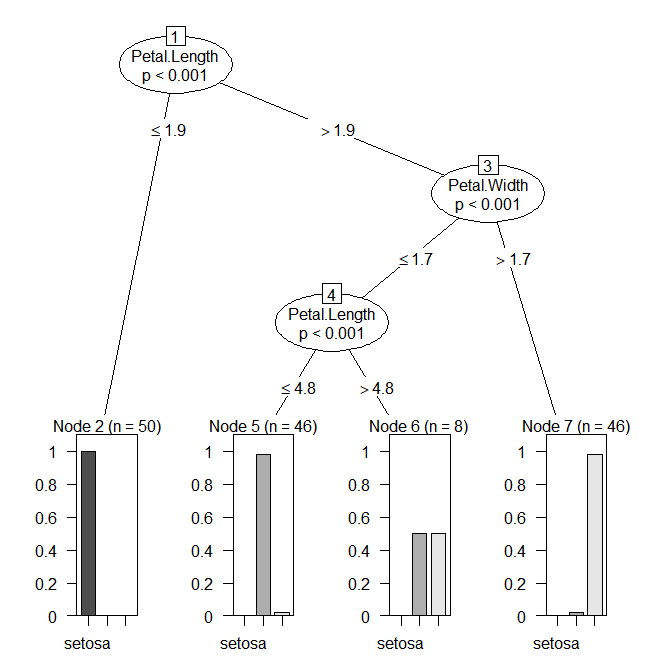
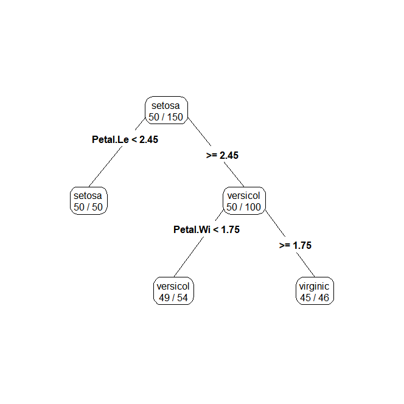

:v:
---
# 데이터 분석
## 데이터 분석 분류
### :heavy_check_mark: 머신러닝(기계학습)
- 사용자가 직접 데이터의 패턴, rule을 찾지 않고 데이터의 학습을 통해 자동으로 패턴을 찾을 수 있도록 하는 분석기법

#### 지도학습(supervised learning)
`타겟값, 종속변수, Y 존재`

- Y에 영향을 미치는 설명변수의 최적의 조합을 찾는 과정
(변수의 선택 및 제거, 변수의 결합 및 변형)

##### 1. 회귀기반 모델
- Y가 연속형일 경우
`부동산 가격 예측, 수요예측...`
##### 2. 분류기반 모델
- Y가 범주형일 경우
`생존여부 예측, 이탈여부 예측...`


#### 비지도학습(unsupervised learning)
`타겟값, 종속변수 Y 존재` :x:
        
- x들이 갖는 각 관측치의 유사성을 기반으로 데이터를 세분화

### :heavy_check_mark: 딥러닝
- 머신러닝의 일부, 딥러닝에 대한 연구가 강화되면서 기존 머신러닝에서 분리하여 설명하는 추세
- 주로 인공신경망 모델을 사용한 분석기법을 의미
- 머신러닝에 비해 비정형화된 데이터 처리에 용이함
`비정형 데이터란? - 이미지, 음성, 영상`


# 시각화
- 시각화할 데이터 로드시에 `stringsAsFactors = F`로 옵션을 주게 되면 시각화 컬러를 지정할 때 컬럼을 바로 줄 수 없다. 컬러 옵션에서 컬럼을 받을 때 Factor type은 숫자를 동시에 갖고 있기 때문에 가능하다 :star:

---
# 데이터 분석의 순서
1. **데이터 수집**
2. **변수연구 ( 어떤 변수로 설명할 것인가 )**
3. **전처리**
4. **이상치, 결측치 처리**

# [ 분류분석 - 범주형 ] 
X들이 가지는 패턴에 따라 Y의 종류를 에측하기 위한 분석
- 분류분석 과정
    - 데이터 수집(Y에 영향을 미칠만한 모든 데이터)
    - 변수연구(feature selection/변수결합/변수변형)
    - 이상치 및 결측치 처리
    - 모델 선택
    - data sampling(train set/validation set/test set)
    - 모델 학습(train set)
    - 모델 평가(test set)
    `실제 정답과 예측값과의 일치율로 평가`
    - 모델 튜닝(validation set)
    - 결과 해석


- 분석기법 종류
    1. kNN
        - 거리기반
    2. NB
        - 통계기반, 확률기반
    3. DT
        - 트리기반, 단일 의사결정
    4. RF
        - 트리기반
    5. SVM
        - 회귀 기반 모델
        - 난이도 높다
        - 해석, 패턴확인 어렵다
            - 블랙박스 모델


#  Decision Tree (의사결정나무)
- 분류분석을 수행하는 트리기반 모델의 가장 초기 모델
- 한번의 패턴확인으로 Y를 예측
- 패턴이 Tree 구조를 띔
- 비통계적 모델로 모델 적용 및 해석이 매우 쉽다
- 단일의사결정이므로 예측력이 불안하거나 overfit될 수 있음
- 가장 예측력이 우수한 중요질문을 상위 노드 (Root) 에 배치한다.

    **overfit이란?**
train data에 대한 과도하게 세세한 학습으로 인해 새로운 데이터(**new data** or **test data**)에 대한 예측력이 떨어지는 현상


## 모델 시각화
### :heavy_check_mark: `ctree`
조건부 추론 나무 (ctree)

- 기존 의사결정나무가 각 노드의 선택에 통계적 유의성 검정을 할 수 없다는 단점을 보완

- `ctree()`함수는 `rpart()
`함수의 두 가지 문제점을 해결해준다.
    
    1. 통계적 유의성에 대한 판단 없이 노드를 분할하는 데 따른 과적합
    
    2. 다양한 값으로 분할 가능한 변수가 다른 변수에 비해 선호되는 문제
- `ctree`는 조건부 분포에 따라 변수와 반응값 사이의 연관 관계를  측정하여 노드 분할에 사용할 변수를 선택한다. 또 적절한 시점에 노드의 분할을 중단한다. 때문에 `rpart`가 과적합 등의 이유로 성능이 잘 나오지 않는 경우 조건부 추론 나무를 사용해 볼 필요가 있다.

```r
install.packages('party')
library(party)

m1 <- ctree(formula = Species ~.,
            data = iris)
m1

dev.new()
plot(m1)
```



### :heavy_check_mark: `rpart`
- CART(Classification And Regression Trees) 방법을 사용

> 전체 테이터셋을 갖고 시작해, 반복해서 두 개의 자식 노드를 생성하기 위해 모든 예측 변수를 사용하여 데이터 셋의 부분집합을 쪼갬으로서 Decision Tree를 생성한다. CART는 Gini index가 작아지는 방향으로 움직이며, Gini index를 가장 많이 감소시켜 주는 변수가 영향을 가장 많이 끼치는 변수가 된다.
```r
install.packages('rpart')
library(rpart)

m_dt <- rpart(Species ~., data = iris)
m_dt

dev.new()
plot(m_dt, compress= T) # compress => Tree를 좀더 조밀하게 그림
text(m_dt, cex=1.5) # cex => 글씨 크기
```
:star: `console`에서 해석방법
- 1). 동일 비율일 때는 가장 앞에 있는 대상(0.3333)의 이름
- 2). node 마지막에 * 가 찍혀있는것은 분류가 끝났다는 의미
- 3). node에는 질문을 주고 질문에 대한 정분류개수와 오분류개수를 표시함

```
> m_dt # rpart(Species ~., data = iris)
n= 150 

node), split, n, loss, yval, (yprob)
      * denotes terminal node

1) root 150 100 setosa (0.33333333 0.33333333 0.33333333)  
  2) Petal.Length< 2.45 50   0 setosa (1.00000000 0.00000000 0.00000000) *
  3) Petal.Length>=2.45 100  50 versicolor (0.00000000 0.50000000 0.50000000)  
    6) Petal.Width< 1.75 54   5 versicolor (0.00000000 0.90740741 0.09259259) *
    7) Petal.Width>=1.75 46   1 virginica (0.00000000 0.02173913 0.97826087) *
```

### :heavy_check_mark: `rpart.plot`
```r
install.packages('rpart.plot')
library(rpart.plot)
prp(m_dt, type=4, extra = 2, digits = 3)
# type = tree의 형태를 바꿔준다. (0~5)
# extra = 노드에 존재하는 원소의 개수 표현방법을 바꿔준다 (정수, 분수, 실수 등)
```



### 평가점수를 일반화
평가점수 일반화를 위해 데이터셋을 train, test 7:3으로 나눠준다. 경험적으로 예측 성공률이 올라가기 때문이다.

1. sampling
```r
v_rn <- sample(1:nrow(iris), size = nrow(iris) * 0.7)
iris_train <- iris[v_rn, ]
iris_test <- iris[-v_rn, ]
```

2. modeling
```r
m_dt <- rpart(data = iris_train, formula = Species ~ .)
```

3. 모델 시각화
4. 모델 평가
```r
iris_test$Species
predict(m_dt, newdata = iris_test, type='class')
```

5. score
:warning: test set을 predict에도 이용하는 이유
>predict는 예측하고 싶은 y값을 모른다는 가정하에 예측을 시도하고 test set과 비교하기 위함
```r
v_y <- iris_test$Species
v_predict <- predict(m_dt, newdata = iris_test, type='class')

v_score <- sum(v_y == v_predict) / nrow(iris_test) * 100
```

6. 모델튜닝
```r
m_dt$control 
# $minbucket 값의 의미는 추가 분류를 시도할 최소한의 원소갯수의 기준을 표시
```

- 매개변수 종류
    - minbucket
        - 추가 하위 노드를 생성하기 위한 오분류 데이터의 최소 기준
        - 값이 작을수록 모델의 복잡도는 커짐
    - minsplit
    `minbucket = round(minsplit/3)`
        - 루틴이 분할 계산을 시도하기 위하여 노드에서 관측의 최소 수. 기본값은 20 이다. 이 파라메터는 계산 시간을 절약할 수 있고, 그래서 작은 노드들은 교차-검증에 의해 거의 대부분 항상 잘려 나간다.
    - cp
        - 모델의 복잡도를 직접 제어하는 매개변수
        - 0 ~ 1 사이값을 가지며 cptable의 확인을 통해 값 전달
    - maxdepth
        - 각 노드에 사용되는 설명변수의 재사용 횟수 제한
        - 작을수록 모델의 복잡도는 낮아진다.

- 매개변수 조정
```r
m_dt2 <- rpart(data = iris_train,
               formula = Species ~ . ,
               control = rpart.control(minbucket=2))
m_dt2
```
- 최적의 매개변수 값 확인
minbucket이 1~10 변화될 때의 예측력 변화를 확인한다.
overfit 여부까지 확인
- 1부터 10까지의 train dataset 점수와 test dataset의 점수를 비교하고 변화 정도 확인

```r
v_tr_score <- c()
v_te_score <- c()

for ( i in 1:10) {
    m_dt <- rpart(data = iris_train,
                  formula = Species ~ . ,
                  control = rpart.control(minbucket=i))
    
    # train data score
    tr_pre <- predict(m_dt, newdata=iris_train, type='class' )
    tr_score <- sum(iris_train$Species == tr_pre)/nrow(iris_train) * 100
    
    # test data score
    te_pre <- predict(m_dt, newdata = iris_test, type = 'class')
    te_score <- sum(iris_test$Species == te_pre)/nrow(iris_test) * 100
    
    # 벡터화
    v_tr_score <- c(v_tr_score, tr_score)
    v_te_score <- c(v_te_score, te_score)
}

v_tr_score
v_te_score
```
- 서로 10% 가까이 차이가 난다면 overfit이 발생했다고 볼 수 있다.


### Cancer data
```r
cancer <- read.csv('cancer.csv')

dev.new()
plot(cancer[,3:11], col = cancer$diagnosis)
```
- 데이터프레임에 plot을 씌우면 교차 산점도를 표현하는데 이때 컬럼간의 상호연관성이 높은 컬럼을 식별할 수 있고, 이를 통해 각 설명변수의 중요도의 의미를 파악할 수 있다.


---
:fire:
---